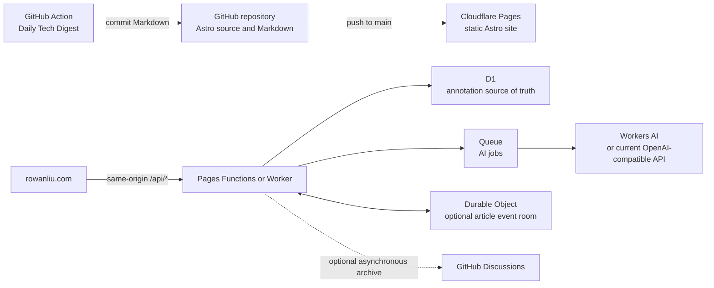

# Cloudflare-First Migration Plan

Status: Phases 0 through 6 complete

Last updated: 2026-08-04

Repository: `llccing/llccing.github.io`
Production domain: `https://rowanliu.com`

## Execution Status

- Phase 0 and Phase 1 completed on 2026-08-02. Evidence:
  `docs/cloudflare-first-migration-phase-0-1-report.md`.
- Phase 2 completed on 2026-08-02. Cloudflare Pages now serves the apex domain,
  `www` redirects to the apex with path and query preservation, and the GitHub
  Pages rollback path remains active. Evidence:
  `docs/cloudflare-first-migration-phase-2-report.md`.
- Phase 3 completed on 2026-08-02. Same-origin annotation APIs, cookie-based
  owner authentication, and `/annotations/` are live. Evidence:
  `docs/cloudflare-first-migration-phase-3-report.md`.
- Phase 4 completed on 2026-08-04. D1 contains a count-verified import and the
  Worker now mirrors successful GitHub mutations to D1 without making public
  reads depend on D1. Evidence:
  `docs/cloudflare-first-migration-phase-4-report.md`.
- Current operational state, DNS propagation notes, and next-agent instructions
  are recorded in `docs/cloudflare-first-migration-handoff.md`.
- Phase 5 completed on 2026-08-04. D1 is authoritative, writes are optimistic,
  and GitHub Discussions are an asynchronous mirror. Evidence:
  `docs/cloudflare-first-migration-phase-5-report.md`.
- Phase 6 completed on 2026-08-04. Queue-based Workers AI replies, D1 job
  states, retry controls, conditional polling, the legacy workflow marker, and
  cleanup were production verified. Evidence:
  `docs/cloudflare-first-migration-phase-6-report.md`.
- Phases 7 and 8 have not started.

## 1. Purpose

Migrate the blog's production runtime from GitHub Pages and GitHub-backed inline
annotations to a Cloudflare-first architecture while preserving GitHub as the
source repository and as the execution environment for repository-oriented
automation.

The migration must:

- Keep platform costs at zero under the expected personal-blog workload.
- Improve inline annotation discovery, read latency, write responsiveness, AI
  status feedback, and future real-time behavior.
- Preserve all existing public URLs, Chinese locale behavior, Asia/Shanghai
  publishing assumptions, RSS, search, short stories, static assets, resumes,
  Giscus comments, and SEO metadata.
- Avoid a flag-day migration. Every production switch must have a verified
  rollback path.
- Keep GitHub Pages, GitHub Discussions, and the current comments Worker intact
  until their replacements have passed production verification.

## 2. Executive Decision

Adopt a **Cloudflare-first**, not Cloudflare-only, architecture.

Cloudflare will own:

- Static site hosting and deployment through Cloudflare Pages.
- Same-origin annotation APIs through Pages Functions or a Worker route.
- Inline annotation persistence through D1.
- Asynchronous AI jobs through Queues.
- Optional per-article real-time events through Durable Objects.
- Runtime logs, metrics, and health checks.

GitHub will continue to own:

- The Git repository and Markdown content.
- Pull requests and source history.
- The Daily Tech Digest workflow, because it installs dependencies, validates
  generated Markdown, commits files, and pushes to `main`.
- Giscus article-level public comments, at least during this migration.

The following GitHub Actions should eventually be retired:

- `.github/workflows/deploy.yml`, after Cloudflare Pages production deployment
  is proven.
- `.github/workflows/annotation-ai.yml`, after Queue-based AI processing is
  proven.

The following workflow should remain:

- `.github/workflows/daily-blog-generator.yml`.

## 3. Why This Architecture

Moving static files from GitHub Pages to Cloudflare Pages alone is not expected
to produce a dramatic user-facing speed increase. Both products distribute
static assets through a CDN.

The material performance improvement comes from removing GitHub GraphQL from
the synchronous annotation data path.

Current production measurements from 2026-08-02:

- Public annotation API cache miss: approximately 1,316 ms.
- Public annotation API cache hit: approximately 111-168 ms.
- Create, update, reply, and delete currently perform a GitHub mutation and
  then reload the complete annotation list.

The target design uses D1 for the synchronous read/write path and optimistic UI
updates for immediate feedback. GitHub Discussions may remain as a historical
archive or an asynchronous mirror, but must not block an annotation operation.

## 4. Target Architecture



Recommended public routes:

```text
GET    /api/comments?path=/posts/example/
POST   /api/comments
PATCH  /api/comments/:id
DELETE /api/comments/:id
POST   /api/comments/:id/replies
GET    /api/ai/jobs/:id
GET    /api/owner/session
GET    /auth/github/start
GET    /auth/github/callback
GET    /api/realtime?path=/posts/example/     # optional later phase
```

The frontend should use relative `/api/*` URLs. Production must no longer need
to call a `workers.dev` origin directly once the same-origin API is live.

## 5. Free-Tier Guardrails

The design is based on Cloudflare limits documented on 2026-08-02:

| Product             | Relevant free allowance                                   | Project fit                                            |
| ------------------- | --------------------------------------------------------- | ------------------------------------------------------ |
| Pages builds        | 500 builds/month, one concurrent build, 20-minute timeout | Expected usage is tens of builds/month                 |
| Pages static assets | Free and unlimited requests                               | Appropriate for the static Astro site                  |
| Pages files         | 20,000 files, 25 MiB maximum per file                     | Current `dist` has 677 files; largest is about 0.9 MiB |
| Workers             | 100,000 requests/day, 10 ms CPU per request               | Appropriate for lightweight auth and CRUD handlers     |
| D1                  | 5 million rows read/day, 100,000 rows written/day, 5 GB   | Far above expected annotation usage                    |
| Queues              | 10,000 operations/day, 24-hour retention                  | Appropriate for low-frequency AI jobs                  |
| Durable Objects     | 100,000 requests/day and 13,000 GB-s/day                  | Appropriate if WebSocket Hibernation is used           |
| Workers AI          | 10,000 Neurons/day                                        | Potentially sufficient for low-frequency AI questions  |

Cost constraints:

- Do not enable a paid Workers plan as part of this migration.
- Do not add a service that requires a paid subscription without explicit user
  approval.
- Configure usage monitoring before switching D1 or Queues into production.
- Free-tier exhaustion should fail visibly and recoverably; it must not silently
  discard comments or AI jobs.
- Workers AI is not automatically equivalent in quality to the currently
  configured model. Benchmark output before switching models.
- If the current external AI provider remains in use, its existing model costs
  remain external to Cloudflare. Moving orchestration to Cloudflare does not
  make model inference free.

Official references:

- <https://developers.cloudflare.com/pages/platform/limits/>
- <https://developers.cloudflare.com/pages/configuration/git-integration/>
- <https://developers.cloudflare.com/pages/functions/pricing/>
- <https://developers.cloudflare.com/workers/platform/pricing/>
- <https://developers.cloudflare.com/d1/platform/pricing/>
- <https://developers.cloudflare.com/durable-objects/platform/pricing/>
- <https://developers.cloudflare.com/queues/platform/pricing/>
- <https://developers.cloudflare.com/workers-ai/platform/pricing/>
- <https://developers.cloudflare.com/workflows/reference/pricing/>

## 6. Existing-System Boundaries

The implementing agent must preserve these repository rules:

- Astro components remain the default. React is limited to interactive islands.
- Both `blog` and `short-stories` use `src/layouts/PostDetails.astro`.
- Search and RSS remain blog-only; tag pages aggregate both collections.
- `draft: true` remains hidden everywhere.
- Future-post filtering and Asia/Shanghai scheduling remain unchanged.
- Giscus remains the public article-level comment system.
- Inline annotations remain readable by everyone but writable only by GitHub
  user `llccing`.
- Do not change established routes or public asset URLs.
- Use `pnpm` and preserve `pnpm-lock.yaml`.

Important current files:

- `src/components/InlineComments.tsx`
- `src/layouts/PostDetails.astro`
- `src/comments/protocol.ts`
- `src/utils/rehype-comment-anchors.ts`
- `workers/comments-api/src/index.ts`
- `scripts/comments/respond-to-ai.ts`
- `wrangler.jsonc`
- `.github/workflows/deploy.yml`
- `.github/workflows/annotation-ai.yml`
- `.github/workflows/daily-blog-generator.yml`

## 7. Annotation Product Requirements

### 7.1 Author entry

Replace the hidden `?annotate=1`-only workflow with a discoverable owner flow:

- Add a stable owner entry page such as `/annotations/`.
- Allow the owner to authenticate there with GitHub.
- After authentication, provide a clear annotation-mode toggle on article and
  short-story detail pages.
- Persist the authenticated owner session across article navigation.
- Do not show author controls to public readers.
- Retain `?annotate=1` temporarily as a backward-compatible deep link.

Prefer an HTTP-only, Secure, same-origin session cookie after the API is moved
under `rowanliu.com`. Do not put session tokens in persistent client storage or
expose them in logs.

### 7.2 Create, edit, reply, and delete

All operations already exist in the GitHub-backed implementation and must be
preserved during migration.

Improve the user experience as follows:

- Create, edit, reply, and delete update the local UI optimistically.
- The UI shows `pending`, `saved`, and `failed` synchronization states.
- A failed request rolls back the optimistic state and exposes a retry action.
- The client must not reload the complete article thread list after every
  mutation.
- Each annotation has a compact action menu containing edit, delete, copy link,
  and optional archive-link actions.
- Delete uses an explicit confirmation and clearly states whether replies will
  also be deleted.
- Prefer soft deletion in D1 so an accidental delete can be restored.
- Preserve an optional revision history for edits.

### 7.3 Anchoring and article edits

Continue storing:

- `blockId`
- `headingId`
- `exact`
- `prefix`
- `suffix`
- `view`

Do not rely only on `blockId`. When an article changes:

1. Try the original block ID.
2. Verify the exact quote still matches.
3. Fall back to exact quote plus prefix/suffix context.
4. Mark unresolved annotations as orphaned.
5. Surface orphaned annotations in the owner dashboard for manual repair.

### 7.4 AI behavior

- An explicit `@ai` remains the only AI trigger.
- Creating an AI-triggering annotation creates an `ai_job` in the same D1
  transaction or in an immediately following idempotent operation.
- The API enqueues the job and returns without waiting for model inference.
- The UI displays queued, answering, completed, and failed states.
- Queue retries must be idempotent and must not create duplicate replies.
- A failed job exposes a retry action to the owner.
- Same-site article links remain available as AI context.
- Generate or precompute compact article-context JSON during the Astro build so
  a Worker does not need to parse an entire HTML document at request time.
- Never expose model keys, GitHub tokens, OAuth secrets, or Queue signatures.

## 8. D1 Data Model

The exact migration files may vary, but the logical schema should include:

```sql
CREATE TABLE articles (
  path TEXT PRIMARY KEY,
  title TEXT NOT NULL,
  version INTEGER NOT NULL DEFAULT 0,
  created_at TEXT NOT NULL,
  updated_at TEXT NOT NULL
);

CREATE TABLE annotations (
  id TEXT PRIMARY KEY,
  article_path TEXT NOT NULL,
  author_login TEXT NOT NULL,
  body TEXT NOT NULL,
  block_id TEXT NOT NULL,
  heading_id TEXT,
  exact_text TEXT NOT NULL,
  prefix_text TEXT NOT NULL,
  suffix_text TEXT NOT NULL,
  view TEXT NOT NULL,
  status TEXT NOT NULL DEFAULT 'open',
  github_node_id TEXT,
  created_at TEXT NOT NULL,
  updated_at TEXT NOT NULL,
  deleted_at TEXT,
  FOREIGN KEY (article_path) REFERENCES articles(path)
);

CREATE INDEX annotations_article_path_idx
  ON annotations(article_path, deleted_at, created_at);

CREATE TABLE replies (
  id TEXT PRIMARY KEY,
  annotation_id TEXT NOT NULL,
  author_login TEXT NOT NULL,
  body TEXT NOT NULL,
  kind TEXT NOT NULL DEFAULT 'human',
  github_node_id TEXT,
  created_at TEXT NOT NULL,
  updated_at TEXT NOT NULL,
  deleted_at TEXT,
  FOREIGN KEY (annotation_id) REFERENCES annotations(id)
);

CREATE INDEX replies_annotation_id_idx
  ON replies(annotation_id, deleted_at, created_at);

CREATE TABLE annotation_revisions (
  id INTEGER PRIMARY KEY AUTOINCREMENT,
  resource_type TEXT NOT NULL,
  resource_id TEXT NOT NULL,
  previous_body TEXT NOT NULL,
  changed_at TEXT NOT NULL,
  changed_by TEXT NOT NULL
);

CREATE TABLE ai_jobs (
  id TEXT PRIMARY KEY,
  annotation_id TEXT NOT NULL,
  status TEXT NOT NULL,
  attempt_count INTEGER NOT NULL DEFAULT 0,
  provider TEXT,
  model TEXT,
  error_code TEXT,
  created_at TEXT NOT NULL,
  started_at TEXT,
  completed_at TEXT,
  FOREIGN KEY (annotation_id) REFERENCES annotations(id)
);

CREATE UNIQUE INDEX ai_jobs_annotation_id_idx
  ON ai_jobs(annotation_id);
```

Schema rules:

- IDs must be globally unique and generated before optimistic insertion.
- All public list queries must filter out soft-deleted rows.
- All article-path queries must use an index.
- Every successful mutation increments the article version.
- D1 migrations must be committed and tested locally before remote application.
- Back up exported data before every destructive schema migration.

## 9. Real-Time Design

Real-time delivery is optional and must not block the initial migration.

If implemented, use one SQLite-backed Durable Object per normalized article
path:

```text
ArticleRoom("/posts/example/")
```

The Durable Object broadcasts lightweight events, not authoritative complete
state:

```text
annotation.created
annotation.updated
annotation.deleted
reply.created
reply.updated
reply.deleted
ai.queued
ai.answering
ai.completed
ai.failed
```

Each event must contain:

- Article path.
- Article version.
- Resource ID.
- Event type.
- Event timestamp.

Requirements:

- Use the WebSocket Hibernation API.
- Implement reconnect with bounded exponential backoff.
- On reconnect, compare article versions and refetch REST state when necessary.
- Do not send OAuth tokens, provider keys, or private configuration over the
  socket.
- The complete feature must still work if WebSocket connection fails.

Before Durable Objects are added, AI status may use short polling only while a
job is pending.

## 10. Migration Phases

### Phase 0: Baseline, backup, and feature inventory

Tasks:

- Record current production HTTP, build, CRUD, OAuth, Giscus, desktop, and
  mobile behavior.
- Export all inline annotation Discussion comments and replies to a local JSON
  artifact outside the public site output.
- Record counts and stable GitHub node IDs.
- Capture current DNS and Pages settings needed for rollback.
- Confirm all current secrets by name only; never print secret values.

Exit criteria:

- Reproducible baseline report exists.
- Annotation backup can be parsed and count-verified.
- Worktree is clean or unrelated user changes are explicitly identified.

### Phase 1: Cloudflare Pages preview deployment

Tasks:

- Create a Git-integrated Cloudflare Pages project connected to this repository.
- Use production branch `main`.
- Use `pnpm build` and output directory `dist`.
- Pin a supported Node version rather than relying on the Pages default.
- Configure:
  - `PUBLIC_INLINE_COMMENTS=true`
  - The temporary current comments endpoint for preview validation.
- Keep `rowanliu.com` on GitHub Pages during this phase.
- Validate the generated `*.pages.dev` deployment.

Exit criteria:

- `pnpm build` passes in Cloudflare.
- Homepage, posts, short stories, tags, search, RSS, sitemap, assets, resumes,
  404 behavior, Giscus, and inline comments match production.
- Preview branches create isolated preview URLs.
- The site remains within Pages file and build limits.

### Phase 2: Custom domain cutover

Tasks:

- Attach `rowanliu.com` and the canonical `www` behavior to Pages.
- Preserve the same canonical domain and paths.
- Verify TLS before changing production DNS.
- Change DNS only after the Pages preview passes.
- Keep GitHub Pages deployment configuration and `gh-pages` available for the
  observation period.

Exit criteria:

- Production returns HTTP 200 for representative pages.
- Canonical URLs, RSS links, sitemap URLs, Giscus pathname mapping, and social
  metadata remain correct.
- No mixed content, redirect loop, missing asset, or mobile overflow occurs.
- A documented DNS rollback can restore the previous host.

Do not remove `.github/workflows/deploy.yml` yet.

### Phase 3: Same-origin API and owner-entry improvement

Tasks:

- Expose the existing Worker behavior under `/api/*` and `/auth/*` on
  `rowanliu.com`.
- Update the frontend to use relative URLs.
- Replace fragment/sessionStorage authentication with a secure same-origin
  session cookie where practical.
- Add `/annotations/` and the persistent owner annotation-mode workflow.
- Preserve the existing GitHub-backed API behavior during this phase.

Exit criteria:

- Public users can read but cannot write.
- Only GitHub user `llccing` can create, edit, reply, and delete.
- OAuth returns to the exact normalized article path.
- No token remains in the address bar, logs, or client-persistent storage.
- Existing Giscus behavior is unchanged.

### Phase 4: D1 shadow writes and data import

Tasks:

- Add versioned D1 migrations.
- Import the exported GitHub annotation data.
- Verify counts, bodies, replies, authors, timestamps, and anchors.
- Continue reading from GitHub while writing new mutations to both GitHub and
  D1.
- Record mismatches without silently repairing or deleting source data.
- Build an idempotent reconciliation command.

Exit criteria:

- Imported and live-shadowed records match GitHub.
- Re-running import or reconciliation creates no duplicates.
- D1 errors do not corrupt GitHub source data.
- No user-visible read path depends on D1 yet.

### Phase 5: D1 primary read/write switch

Implementation status: completed on 2026-08-04. Production observation and
the Phase 6 authorization boundary remain active.

Tasks:

- Switch reads to D1.
- Switch writes to D1 and use optimistic client updates.
- Move GitHub mirroring off the synchronous request path with
  `ExecutionContext.waitUntil()`. Queue-backed durability is deferred to the
  explicitly separate Phase 6.
- Add versioned responses, conditional refetch, soft delete, and revision
  history.
- Add latency and error metrics.

Exit criteria:

- Create, edit, reply, and delete pass against production D1.
- UI feedback appears within 100 ms under normal browser conditions.
- Mutations do not trigger a complete list reload.
- Public list results exclude deleted and unauthorized content.
- D1 p95 read latency and error rate are measured, not assumed.
- GitHub API failure no longer blocks a successful D1 annotation operation.

### Phase 6: Queue-based AI replacement

Tasks:

- Enqueue an AI job when an owner annotation explicitly contains `@ai`.
- Implement an idempotent Queue consumer.
- Reuse same-site article context with strict input limits.
- Write the answer as a D1 reply.
- Add queued, answering, completed, failed, and retry UI states.
- Benchmark Workers AI against the current model before changing provider.

Exit criteria:

- Duplicate Queue delivery cannot create duplicate AI replies.
- Failure and retry behavior are visible and tested.
- AI keys never reach the browser.
- AI completion does not depend on GitHub Actions or Discussion events.

After an observation period, disable and then remove
`.github/workflows/annotation-ai.yml`.

### Phase 7: Optional Durable Object real-time events

Tasks:

- Implement one article room per normalized path.
- Add WebSocket Hibernation.
- Broadcast versioned mutation and AI status events.
- Add reconnect and REST reconciliation.

Exit criteria:

- Two tabs converge after create, edit, delete, and AI completion.
- Disconnect/reconnect loses no durable data.
- REST-only fallback remains functional.
- Durable Object usage remains within the free tier.

### Phase 8: Retire old deployment workflow

Tasks:

- Observe stable Cloudflare Pages production deployments.
- Confirm Cloudflare deploys every desired `main` commit.
- Verify how the Daily Tech Digest `[skip ci]` commit marker interacts with
  Cloudflare Pages. Remove or change it if it suppresses required builds.
- Ensure scheduled future posts receive a rebuild. Use a free Cron-triggered
  Pages Deploy Hook if content can become publishable without a new commit.
- Disable `.github/workflows/deploy.yml` before deleting it.

Exit criteria:

- At least one normal content deployment and one Daily Tech Digest deployment
  have succeeded through Cloudflare Pages.
- Production rollback is documented and tested.
- GitHub Pages is no longer receiving production traffic.

Only then remove the old deployment workflow and optional `gh-pages` publishing
configuration.

## 11. Validation Matrix

Every phase that changes production behavior must validate:

### Build and static site

- `pnpm lint`
- `pnpm test`
- `pnpm check:worker`
- Production-flagged `pnpm build`
- Astro Check: no errors, warnings, or hints introduced by the change
- Jampack completes successfully
- Targeted Prettier checks for changed files
- `git diff --check`

The repository has historical global formatting issues. Do not rewrite
unrelated files merely to make a global formatting command pass.

### Routes and content

- `/`
- A representative `/posts/.../`
- A representative `/short-stories/.../`
- `/search/`
- `/tags/.../`
- `/rss.xml`
- `/sitemap-index.xml` or the configured sitemap route
- `/about/` and both resume asset URLs
- 404 behavior
- Scheduled and draft filtering

### Annotation behavior

- Public list with zero threads
- Public list with existing threads
- Owner OAuth success and wrong-account rejection
- Create whole-block annotation
- Create same-block text-selection annotation
- Edit annotation
- Reply
- Edit and delete owner reply
- Delete annotation and verify reply behavior
- `@ai` success, failure, retry, and idempotency
- Same-site link rendering
- Anchor recovery after article text changes
- No public write controls

### Browser and accessibility

- Desktop viewport without horizontal overflow
- Mobile 390 x 844 without horizontal overflow
- Mobile table containment
- Bottom-sheet layout
- Keyboard focus and screen-reader labels
- Giscus iframe remains present
- No token or secret appears in URL, DOM, console, or network response body

## 12. Observability and Performance Targets

Add structured metrics for:

- Route name and response status.
- D1 query duration and row counts.
- Queue enqueue, retry, completion, and dead-letter outcomes.
- AI provider and model without prompt or secret leakage.
- Annotation operation type.
- WebSocket connection and reconnect counts if enabled.
- Cloudflare free-tier consumption.

Initial targets:

- Optimistic UI update: under 100 ms.
- Cached/static page delivery: no regression from current production.
- D1 comment read p95: target under 300 ms, then tune from real data.
- CRUD server response p95: target under 500 ms, excluding AI completion.
- AI enqueue response: target under 500 ms.
- Real-time event delivery: target under 500 ms when connected.

Targets are acceptance goals, not assumed guarantees. Measure from production.

## 13. Security Requirements

- Retain strict article-path normalization.
- Validate exact allowed origins during the transition; prefer same-origin after
  cutover.
- Authenticate every write server-side.
- Authorize exact owner login `llccing` server-side.
- Use CSRF protection for cookie-authenticated mutations.
- Rate-limit authentication and mutation endpoints even though they are
  owner-only.
- Validate all D1 and Queue payloads with structured schemas.
- Use parameterized D1 queries only.
- Sign any external callback or archive-mirroring request.
- Never expose OAuth secrets, GitHub tokens, AI keys, session tokens, or signed
  internal payloads.
- Do not place sensitive data in Pages public environment variables.
- Keep public comments readable without authentication.

## 14. Rollback Strategy

### Pages rollback

- Keep the last verified GitHub Pages deployment and DNS values during the
  observation period.
- If Pages validation fails, restore DNS to the previous GitHub Pages target.
- Do not delete the `gh-pages` branch until the migration is fully accepted.

### API rollback

- Keep the current Worker deployment and URL available.
- Use a frontend feature flag or deployment variable to switch between the
  same-origin API and the current Worker endpoint.

### D1 rollback

- Preserve the pre-migration GitHub Discussions export.
- During shadow-write phase, GitHub remains authoritative.
- After D1 becomes authoritative, export D1 before destructive migrations.
- Never roll back by deleting unmatched records automatically.

### AI rollback

- Keep `.github/workflows/annotation-ai.yml` active and retained during the
  first Queue observation period. Site-created Queue annotations carry a marker
  that makes the workflow skip them, while direct legacy GitHub annotations
  remain compatible.
- Roll the Worker back to the last Phase 5 version if Queue processing affects
  API correctness. Do not delete Queue or D1 history during rollback.

## 15. Explicit Non-Goals

Do not include these in the initial migration:

- Replacing GitHub as the source repository.
- Replacing Giscus with a custom public multi-user comment system.
- Migrating Daily Tech Digest to Cloudflare merely for platform uniformity.
- Moving the entire Astro site to SSR.
- Adding paid Cloudflare products.
- Adding Durable Objects before D1 CRUD and optimistic UI are stable.
- Deleting legacy GitHub Discussions or Giscus comments.
- Bulk-formatting unrelated repository files.

## 16. Agent Execution Rules

An implementation agent must:

1. Read `AGENTS.md` and inspect current repository state before editing.
2. Treat this document as architecture direction, not permission to perform all
   phases in one unreviewed change.
3. Implement one migration phase at a time with explicit validation evidence.
4. Keep production backwards-compatible until a phase exit criterion passes.
5. Deploy API/data changes before frontend changes that depend on them.
6. Never mutate or delete production comments during tests without exact IDs and
   a cleanup plan.
7. Use dedicated temporary test annotations and remove them after verification.
8. Preserve unrelated user changes in a dirty worktree.
9. Do not commit secrets, generated tokens, local Wrangler state, or database
   exports containing sensitive data.
10. Stop and report before any irreversible DNS, credential, database, or
    GitHub Discussion deletion that is not already explicitly approved.

## 17. Recommended First Implementation Task

Start with **Phase 0 and Phase 1 only**:

- Produce the baseline and backup artifacts.
- Create the Cloudflare Pages preview project.
- Configure and validate the Astro build on `*.pages.dev`.
- Do not change production DNS.
- Do not alter the current annotation storage.
- Do not disable any GitHub Action.

The output of the first task should be a reviewable report containing:

- Cloudflare Pages project name and preview URL.
- Build configuration and environment variable names.
- Build/run evidence.
- Route and browser QA evidence.
- Current annotation backup counts without secrets.
- Discovered migration blockers.
- A go/no-go recommendation for Phase 2.
