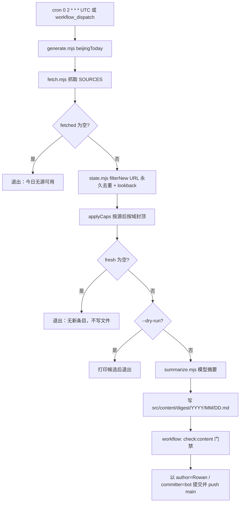
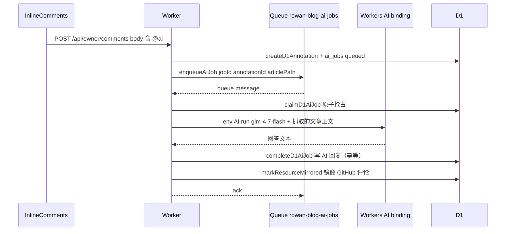

# AI 管线

仓库里有**三条独立的 AI 流程**，触发方、运行时、模型与数据流各不相同，混在一起改容易互相踩坏：

1. **digest 生成**（Node 脚本，GitHub Actions cron 驱动）——每天 10:00 上海时间生成一份 `src/content/digest/YYYY/MM/DD.md`。
2. **Worker Queue 批注 AI**（生产主路径）——批注含 `@ai` 时由 Worker 投递 Queue，Workers AI 回答，回复写回 D1 并镜像 GitHub。
3. **GitHub Action 批注 AI**（旧路径，`annotation-ai.yml`）——`discussion_comment` 事件触发，OpenAI Responses 直接回复 GitHub。

digest 属于 [内容与发布](../content/publishing.md) 的输入边界；批注协议的 marker 与限额定义在 `src/comments/protocol.ts`（见 [运行时与路由](../runtime/routes.md)）。

## 1. digest 生成管线

脚本在 `scripts/digest/`，全部为 `.mjs`，不依赖 Astro 侧类型。

| 阶段 | 文件 | 职责 |
| --- | --- | --- |
| 源注册表 | `sources.mjs` | `SOURCES`（13 个源、4 个域）、`MAX_PER_DOMAIN = 10`、`DOMAINS`/`DOMAIN_LABELS`；与 `src/config.ts` 的 `DIGEST_DOMAINS` 必须同步 |
| 抓取 | `fetch.mjs` | `github-releases`（GitHub Releases JSON API）与 `rss`（fast-xml-parser）；15s 超时（`AbortSignal.timeout`）；单源失败仅 warning 不阻断；`include`/`exclude`/`prereleases`/`maxPerRun`/`lookbackDays` 噪声控制；URL 只来自上游 feed |
| 去重/限额 | `state.mjs` | `loadSeenUrls` 从已发布 digest 的 frontmatter 读 URL（状态即内容，无独立 state 文件）；`filterNew` 按 URL 永久去重 + per-item lookback 窗口；`applyCaps` 先按源后按域封顶（**先去重后封顶**，避免配额被已覆盖项占满） |
| 摘要 | `summarize.mjs` | OpenAI-compatible Chat Completions（`choices`）与 Responses（`output_text`/`output`）双契约 `extractResponseText`；`normalizeBaseURL` 自动补 `/v1`；模型只按索引引用，不产 URL；8000 tokens 上限；失败即 throw（不降级模板） |
| 生成/写文件 | `generate.mjs` | `beijingToday()`（Asia/Shanghai）→ 去重/限额 → 分组 → `buildFrontmatter` + 正文 + `renderSources` → 写 `src/content/digest/YYYY/MM/DD.md`；无新条目不写文件；`--dry-run`（不调模型）、`--force`（覆盖今日）、`--offline`（无模型模板，仅本地开发用，**不用于 CI**） |

CI 契约（`.github/workflows/daily-blog-generator.yml`）：

- cron `0 2 * * *`（UTC）= 上海 10:00，注释明确日期锚定上海；`workflow_dispatch` 带 `force` 输入用于重跑覆盖。
- 密钥：`AI_API_KEY`/`AI_BASE_URL`/`AI_MODEL`（模型请求）、`GITHUB_TOKEN`（匿名 GitHub API 限流提升）、`BLOG_PAT`（push 权限）。
- “无变化即正常”：`git status src/content/digest` 无改动时跳过校验与提交，不报错。
- 有改动必须过 `pnpm check:content`（历史教训：旧生成器曾提交空占位文件）。
- 提交作者是 Rowan 本人邮箱（贡献图）、committer 是 `github-actions[bot]`；**不加 `[skip ci]`**——Cloudflare Pages 同样会 honor 它，导致 digest 已提交但不发布。

验证：`pnpm digest:dry`（抓取+去重，不调模型）；`pnpm digest:offline`（本地写无模型摘要）；`scripts/digest/summarize.test.mjs` 覆盖响应抽取与形状描述。

## 2. Worker Queue 批注 AI（生产主路径）

触发链（见 [运行时与路由](../runtime/routes.md) 的 Worker 分区）：

1. `POST /api/owner/comments` 创建批注，`extractAnnotationText(body)` 命中 `/@ai\b/i` 时生成 `ai_job_id`（`crypto.randomUUID()`），`createD1Annotation` 写 `ai_jobs(status=queued)`。
2. `enqueueAiJob` 投递 `rowan-blog-ai-jobs`；投递失败标 `enqueue_failed` 并让前端看到 failed 状态。
3. consumer `processAiMessage`（`workers/comments-api/src/index.ts`）→ `claimD1AiJob` 原子抢占（并发双投递时第二个得到 `null`/`"completed"` 直接 ack）→ `answerAiJob` → `completeD1AiJob` 写 AI 回复（author `rowan-ai`）→ `scheduleGitHubMirror` 镜像到 GitHub，回复体带 `rowan-ai-queue:v1` 标记。
4. 失败重试：`min(15 * 2^attempts, 120)` 秒指数退避，第 3 次尝试后 ack 放弃；前端 `startSequentialPolling` 1.5s 轮询 AI job 状态直到 `completed|failed`。

模型：Workers AI 原生 binding（`env.AI`），`AI_MODEL = "@cf/zai-org/glm-4.7-flash"`、`AI_PROVIDER = "workers-ai"`（常量在 `index.ts` 顶部）；正文上下文经 `HTMLRewriter` 抓取（当前文章 12 000 字符、关联文章 ≤3 篇各 6 000）；system prompt 要求中文、引用真实内容、不编造；700 tokens、temperature 0.2、`enable_thinking: false`。

## 3. GitHub Action 批注 AI（旧路径）

`.github/workflows/annotation-ai.yml` + `scripts/comments/respond-to-ai.ts`：

- 触发：`discussion_comment` `created|edited`；eligibility 全部满足才回答：作者为 `llccing`、正文含 `@ai`、**不含 `rowan-ai-queue:v1`**（跳过镜像自 Worker 的评论）、`parseAnnotationMetadata` 命中 `rowan-annotation:v1`、`metadata.path` 与 discussion title 规约一致、无已存在的 `AI_REPLY_MARKER` 回复（`hasExistingReply` 防重）。
- 上下文：从仓库 Markdown 直接读（`loadArticle`，当前文章 12 000、关联文章 6 000），而非抓取线上 HTML。
- 模型：OpenAI SDK `client.responses.create`（Responses API），`OPENAI_MODEL` 默认 `gpt-5-mini`，密钥来自 `OPENAI_API_KEY`/`OPENAI_BASE_URL`（= secrets `AI_API_KEY`/`AI_BASE_URL`）。
- 回复：GitHub GraphQL `addDiscussionComment` 回复原评论，正文带 `<!-- rowan-ai-reply:v1 {comment.node_id} -->` 标记用于去重。

## 三路对比与并存风险

| 维度 | digest 管线 | Worker Queue 批注 AI | GitHub Action 批注 AI |
| --- | --- | --- | --- |
| 触发 | cron（上海 10:00）+ dispatch | `POST /api/owner/comments` 含 `@ai` | `discussion_comment` created/edited |
| 运行时 | Node 脚本（CI runner） | Worker queue consumer | GitHub Actions runner |
| provider/model | env `AI_API_KEY`/`AI_MODEL`（OpenAI-compatible） | Workers AI `@cf/zai-org/glm-4.7-flash` | OpenAI Responses，env `OPENAI_MODEL` 默认 `gpt-5-mini` |
| marker | 无（frontmatter `generatedBy`） | `rowan-ai-queue:v1`（镜像回复体） | `rowan-ai-reply:v1`（GitHub 回复体） |
| 上下文 | 抓取的 feed 条目 | 线上 HTML（HTMLRewriter 抓正文） | 仓库 Markdown |
| 重试 | 无（失败即 CI 红，可重跑） | Queue 指数退避 ≤3 次 + `ai/retry` API | 无（Action 失败可重跑，`hasExistingReply` 防重） |
| 部署责任 | `.github/workflows/daily-blog-generator.yml` | `wrangler` 部署 Worker + D1 migration | `.github/workflows/annotation-ai.yml` |
| 聚焦测试 | `scripts/digest/summarize.test.mjs` | `workers/comments-api/test/{index,d1}.test.ts` | 无单测，靠 workflow 端到端 |

并存风险与注意事项：

- **双路径事件竞争**：Worker 镜像的评论带 `rowan-ai-queue:v1`，Action 路径靠 `!contains(body, "rowan-ai-queue:v1")` 跳过，避免同一批注被两条 AI 路径各回答一次。**改 Action eligibility 时不要移除这个排除。**
- **`annotation-ai.yml` 状态**：代码与 workflow 都在且被 `docs/cloudflare-first-migration-handoff.md` 要求保留（Phase 6 起“跳过含 queue marker 的镜像批注但保持与直接 GitHub 批注兼容”）。它是 legacy、active 还是 transitional 在仓库内无明确声明，标 `Needs confirmation`。
- **模型配置来源不同**：digest 与 Action 用 secrets（`AI_API_KEY`/`AI_BASE_URL`/`AI_MODEL`），Worker 用 `wrangler.jsonc` 的 `ai` binding + 源码常量。改模型时三处要分开改（详见 [部署与运维](../operations/deployment.md)）。
