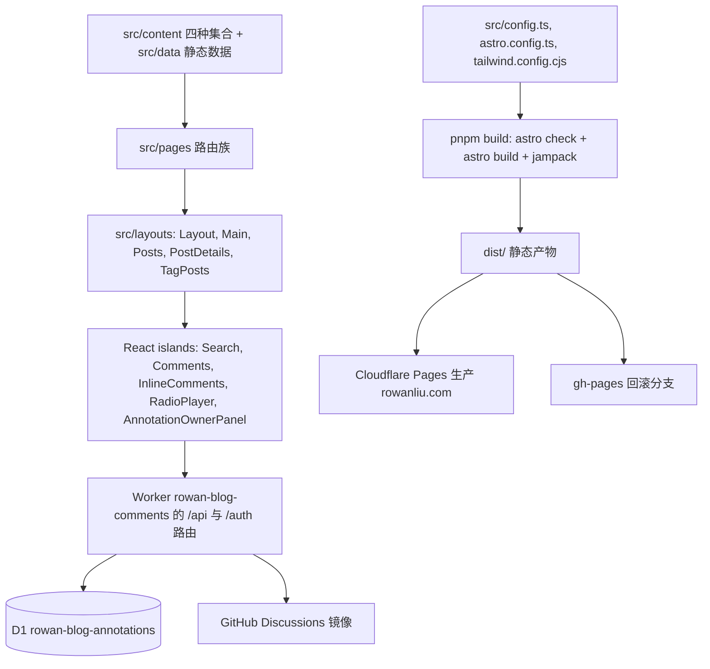

# 站点架构总览

`llccing/llccing.github.io` 是一个基于 AstroPaper 深度定制的**静态博客站点**（生产环境由 Cloudflare Pages 托管），外加一组**运行时服务**：一个 Cloudflare Worker（批注/评论 API + D1 + Queue + Workers AI）和两条 AI 管线（每日 digest 生成、文章批注 AI 回答）。本文解释静态站本身的组成；Worker 与 AI 管线见 [运行时与路由](../runtime/routes.md) 与 [AI 管线](../ai/pipelines.md)。

## 核心事实

- **框架**：Astro 4（`astro@^4.2.1`，`package.json`），完全静态生成（SSG），无 SSR/适配器。
- **样式**：Tailwind CSS 3.4（`@astrojs/tailwind`，`applyBaseStyles: false`）+ `@tailwindcss/typography`；`darkMode: "class"`。
- **交互**：React 18 islands（`@astrojs/react`），仅 5 个客户端岛：`Search`、`Comments`（Giscus）、`InlineComments`、`RadioPlayer`、`AnnotationOwnerPanel`，另有 `PortfolioExperience`（`client:load`）。
- **时区**：`astro.config.ts` 强制 `process.env.TZ = "Asia/Shanghai"`；所有日期逻辑（含 digest 与发布时间 margin）按上海时间解释。
- **站点常量**：`src/config.ts` 的 `SITE`（`website: "https://rowanliu.com"`、`postPerPage: 10`、`scheduledPostMargin: 15 * 60 * 1000`）、`LOCALE`（`lang: "zh-CN"`）、`DIGEST_DOMAINS`（`["angular", "web", "ai", "fullstack"]`）。
- **构建**：`pnpm build` = `astro check && astro build && jampack ./dist`；`postbuild` 复制 `.nojekyll` 到 `dist/`（GitHub Pages 回滚路径需要）。

## 构建与配置层

| 文件 | 职责 |
| --- | --- |
| `astro.config.ts` | 站点 URL、集成（tailwind/react/sitemap）、Markdown 插件链、shiki 主题 `one-dark-pro`、`passthroughImageService`、`scopedStyleStrategy: "where"`、vite `optimizeDeps.exclude: ["@resvg/resvg-js"]` |
| `src/config.ts` | `SITE`/`LOCALE`/`DIGEST_DOMAINS`/`DIGEST_DOMAIN_LABELS`/`SOCIALS`/`LOGO_IMAGE` 单一事实源 |
| `tailwind.config.cjs` | `skin` 颜色体系（`--color-*` CSS 变量 + `withOpacity`）、`fontFamily.mono: ["IBM Plex Mono", "monospace"]`、typography 插件 |
| `src/styles/base.css` | CSS 变量、`.prose` 基线与全局主题（由 `Layout.astro` 引入） |
| `tsconfig.json` | 路径别名 `@assets/@config/@components/@content/@data/@layouts/@pages/@styles/@utils`；`exclude` 掉 `workers` 与 `worker-configuration.d.ts` |

Markdown 处理链（`astro.config.ts` `markdown` 段）：

- `remarkReadingTime`（`src/utils/remark-reading-time.ts`）：把正文折算为 `minutesRead` 写入 `remarkPluginFrontmatter`（`max(1, ceil(cjk/300 + nonCjk/200))`）。
- `remarkToc` + `remarkCollapse`（test 字符串 `"Table of contents"`）：生成可折叠目录。
- `rehypeCommentAnchors`（`src/utils/rehype-comment-anchors.ts`）：为可批注块（`p/h2/h3/h4/li/blockquote/pre/figure`）写入稳定的 `data-comment-block-id` 与 `data-comment-heading-id`，供 `InlineComments` 定位锚点；有单测 `rehype-comment-anchors.test.ts`。
- shiki：`one-dark-pro`，`wrap: true`。

## 内容层

四种内容集合（`src/content/config.ts`，见 [内容与发布](../content/publishing.md)）：

- `blog`（`content` 类型）：常规文章；schema 含 `draft`、`isTranslation`、`featured`、`tags`、`ogImage`（≥ 1200×630 校验）、`canonicalURL` 等。
- `short-stories`：短篇；schema 与 blog 近似，默认 tag `["short-story"]`。
- `originals`：翻译对照的原文，schema 仅 `title` + 可选 `sourceUrl`。
- `digest`：每日 AI 摘要，schema 含 `date`、`domains`（枚举自 `DIGEST_DOMAINS`）、`generatedBy`、`reviewed`、`itemCount`、结构化 `sources` 数组。

## 页面、布局与岛屿

页面家族（`src/pages/`）与布局的完整映射见 [源文件地图](./source-map.md) 和 [运行时与路由](../runtime/routes.md)。关键分层：

- `Layout.astro`：唯一 HTML 外壳（`<html lang="zh-CN">`、canonical、OG/Twitter meta、`PUBLIC_GOOGLE_SITE_VERIFICATION`、`GoogleAnalytics`（仅 `PUBLIC_GA_MEASUREMENT_ID` 且生产）、`ViewTransitions`、`/toggle-theme.js`）。
- `Main.astro`：页头标题 + `Breadcrumbs` 的内容容器。
- `Posts.astro`：文章/短篇归档页，支持目录 pill + 标签下拉的客户端过滤（`data-post-filter-root` 内联脚本），`allPosts` 模式（blog 首页 `isIndex`）下隐藏分页。
- `PostDetails.astro`：文章详情；TOC、译文/原文/对照切换（`sessionStorage["translation-view-mode"]`）、阅读进度条、代码复制按钮；当且仅当 `PUBLIC_INLINE_COMMENTS === "true"` 时挂载 `<InlineComments client:only="react">`；始终挂载 Giscus `<Comments client:only="react">`。
- `TagPosts.astro`：tag 分页页（合并 blog 与 short-stories 两个集合）。

React 岛屿与后端 API 的关系：`InlineComments` 在 `rowanliu.com` 上走同源相对路径 `/api/...`，在 preview 等其他 origin 上退回 `PUBLIC_COMMENTS_API_URL` 绝对地址；`AnnotationOwnerPanel` 固定使用相对 `/api/owner/session`（仅生产同源可用，`Needs confirmation`：preview 上该面板不可用是否是有意为之）。

## 运行时拓扑

## 关键不变量

- **Asia/Shanghai 是唯一时间解释**：`process.env.TZ` 在 `astro.config.ts` 顶部设置，digest 脚本 `generate.mjs` 用 `toLocaleDateString("en-CA", { timeZone: "Asia/Shanghai" })` 取“今天”，`daily-blog-generator.yml` 的 cron `0 2 * * *`（UTC）即上海 10:00。
- **发布 margin**：`postFilter`（`src/utils/postFilter.ts`）= `!draft && (DEV || now > pubDatetime - 15min)`，作用于首页/归档/tag/RSS/搜索；而**详情页** `getStaticPaths` 只过滤 `draft`（`src/pages/posts/[slug]/index.astro`），因此未来 15 分钟内将发布的文章其 URL 已生成但未被任何列表链接（避免发布瞬间 404）。
- **digest 与 blog 分离**：digest 是独立集合，故不会进入 RSS、tag 页或搜索结果（见 [内容与发布](../content/publishing.md)）。
- **翻译配对**：`isTranslation: true` 的 blog 条目依赖同 slug 的 `src/content/originals/<slug>.md`，缺失会让对照视图失效（`check-content.mjs` 以 error 级别拦截，见 [测试与校验](../operations/testing.md)）。
- **island 边界**：默认用 Astro 组件，仅真正需要交互的组件使用 React 岛（`AGENTS.md` 明确此约定）。

## 验证

- 完整构建：`pnpm build`（含 `astro check` 与 jampack）。
- 只查类型：`pnpm astro check`。
- 单测：`pnpm test`（vitest，8 个测试文件，详见 [测试与校验](../operations/testing.md)）。
- 本地预览：`pnpm dev` / `pnpm preview`。