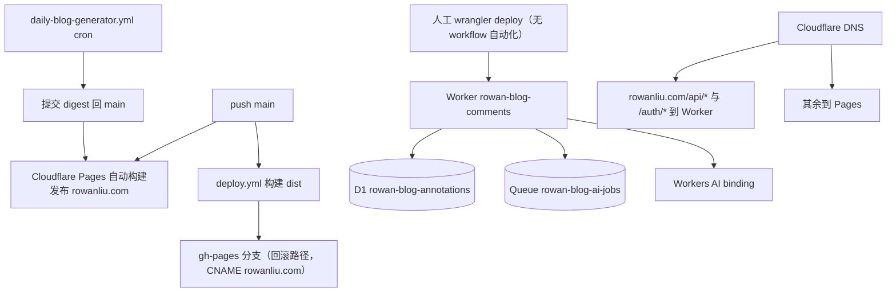

# 部署与运维

生产假设是 **Cloudflare-first**：`rowanliu.com`（及 `www.rowanliu.com`）由 Cloudflare Pages 托管，Cloudflare 同时是注册商与权威 DNS；Worker `rowan-blog-comments` 承接 `/api/*` 与 `/auth/*`；GitHub Pages（`gh-pages` 分支）与 `deploy.yml` 是**保留的回滚路径**。历史背景见 `docs/cloudflare-first-migration-handoff.md` 与 `docs/cloudflare-first-migration-plan.md`（文档为准绳，代码为准）。

## 平台职责与自动化覆盖

| 面 | 实际自动化 | 入口/证据 | 未自动化部分 |
| --- | --- | --- | --- |
| Pages 生产构建/发布 | 仓库外 Cloudflare Pages 集成（push main 自动构建；`daily-blog-generator.yml` 提交的 digest 也会触发）；构建命令与面板配置不在仓库内 | `docs/cloudflare-first-migration-*.md`、`wrangler.jsonc` | 面板构建配置细节（build command/env）标 `Needs confirmation` |
| GitHub Pages 回滚 | `deploy.yml`：`pnpm build`（带 `PUBLIC_INLINE_COMMENTS=true`、`PUBLIC_COMMENTS_API_URL=https://rowan-blog-comments.lcf33123.workers.dev`）→ `peaceiris/actions-gh-pages` 发布 `dist/` 到 `gh-pages`，`cname: rowanliu.com` | `.github/workflows/deploy.yml` | — |
| Worker 部署 | 无 workflow；人工 `wrangler deploy`（`docs/` 记录生产版本 `7f7f8e51-4cb1-41c0-a2b6-f51ce639366e` 等） | `wrangler.jsonc`、`docs/cloudflare-first-migration-handoff.md` | 生产部署未自动化（标 `Needs confirmation` 具体流程） |
| D1 migration | `wrangler.jsonc` 声明 `migrations_dir: "migrations/comments-api"`；remote 已应用 `0001`–`0003` | `migrations/comments-api/*.sql`、handoff | 生产 migration 无 workflow，人工 `wrangler d1 migrations apply` |
| Queue / Workers AI | `wrangler.jsonc` 声明 producer `AI_JOBS`、consumer `rowan-blog-ai-jobs`、`ai` binding | `wrangler.jsonc` | 随 Worker 一起部署 |

`pnpm build`、`pnpm check:worker`、`GET /health` 都是**聚焦验证**，都不是生产部署或 migration 测试。

## 环境变量与密钥

公开构建变量（构建时注入，见 `deploy.yml`）：

| 变量 | 值（仓库内证据） | 用途 |
| --- | --- | --- |
| `PUBLIC_INLINE_COMMENTS` | `"true"`（GitHub Pages 构建） | 决定 `PostDetails.astro` 是否挂载 `InlineComments` 岛 |
| `PUBLIC_COMMENTS_API_URL` | `https://rowan-blog-comments.lcf33123.workers.dev` | preview/跨源时前端 API 绝对地址（同源走相对 `/api/...`） |

Workflow secrets（仅名称可见于 `.github/workflows/*.yml`，值不可见）：

| Secret | 消费方 |
| --- | --- |
| `BLOG_PAT` | `daily-blog-generator.yml` checkout 用（digest 提交权限） |
| `AI_API_KEY`、`AI_BASE_URL`、`AI_MODEL` | digest 脚本（`AI_*`）与 `annotation-ai.yml`（`OPENAI_*`） |
| `GITHUB_TOKEN` | 各 workflow 常规 GitHub API |
| （暂无） | — | OpenWiki 当前为本地/手动试点，未接入 CI，也没有仓库级 OpenWiki secret |

Worker secrets（`wrangler.jsonc` 的 `vars` 是**非机密**，secrets 须 `wrangler secret put`；`requireSecret` 在 `workers/comments-api/src/index.ts`）：

| 名称 | 缺失时行为 |
| --- | --- |
| `GITHUB_TOKEN` | GitHub GraphQL 镜像/检索 503 `setup_required` |
| `GITHUB_OAUTH_CLIENT_ID` / `GITHUB_OAUTH_CLIENT_SECRET` | OAuth start/callback 503 `setup_required` |
| `SESSION_SECRET` | OAuth start 503 `setup_required`（派生会话/state JWT 的 HS256 密钥） |

`wrangler.jsonc` 非机密 vars：`GITHUB_OWNER`、`GITHUB_REPO`、`GITHUB_REPO_ID`、`GITHUB_CATEGORY_ID`、`OWNER_LOGIN`、`SITE_URL`、`ALLOWED_ORIGINS`（生产 + 数个 preview + `localhost:4321`）。

## 构建与校验命令

- `pnpm build` = `astro check && astro build && jampack ./dist`；`postbuild` 复制 `.nojekyll` 到 `dist/`（GitHub Pages 回滚路径需要，避免 Jekyll 处理）。
- `pnpm check:worker` = `tsc --noEmit -p workers/comments-api/tsconfig.json && wrangler deploy --dry-run`（类型 + 配置校验，**不部署**）。
- `pnpm check:content`、`pnpm test`、`pnpm lint`、`pnpm format:check` 见 [测试与校验](./testing.md)。

## 回滚与故障恢复

| 场景 | 回滚/恢复路径 | 依据 |
| --- | --- | --- |
| Pages 生产异常 | Cloudflare 控制台回滚到上一个 deployment（handoff 记录了 Phase 6 deployment `7c315565-…`）；或切换 DNS 到 `gh-pages` | `docs/cloudflare-first-migration-handoff.md` |
| GitHub Pages 回滚生效 | `gh-pages` 分支始终有最新 `dist/` + `CNAME rowanliu.com`；DNS 指向 github.io 时即生效 | `.github/workflows/deploy.yml` |
| Worker 异常 | `wrangler versions` 回滚；handoff 保留 Phase 4/5 版本 `9b4b990d-…`、`4629153e-…` | handoff |
| D1 数据 | `scripts/comments/export-annotations.mjs` 备份（导出 JSON）；迁移 SQL 存 `artifacts/cloudflare-migration/`（gitignore）；导入/对账 `pnpm comments:d1:import` / `comments:d1:reconcile` | `scripts/comments/*` |
| 镜像失败 | 已镜像资源（真实 node id）更新镜像失败后，下次编辑会重试；创建即失败的资源（`pending:` 占位 id）无自动重试，需人工处理（见 [运行时与路由](../runtime/routes.md) 的镜像状态机） | `workers/comments-api/src/index.ts` |
| AI 回答失败 | Queue 自动退避重试 ≤3 次；前端可 `POST /api/owner/annotations/:id/ai/retry` | `workers/comments-api/src/index.ts` |

部分失败语义（重要不变量）：

- **Pages build flags 必须配对**：`PUBLIC_INLINE_COMMENTS` 与 `PUBLIC_COMMENTS_API_URL` 一起注入（`deploy.yml`）；只开 inline comments 不给 API URL 会让非生产 origin 上的批注无法落库。
- **Worker binding 名称必须与 `Env` 用法相符**：`ANNOTATIONS_DB`、`AI_JOBS`、`AI`、`vars` 里的 `SITE_URL`/`ALLOWED_ORIGINS` 在 `workers/comments-api/src/index.ts` 的 `Env` 类型中使用；改名须两边同步，否则 `pnpm check:worker` 的 dry-run 与运行时都会失败。
- **digest 提交不写 `[skip ci]`**：`daily-blog-generator.yml` 注释明确 Cloudflare Pages 也 honor 该 token，写了会导致 digest 已提交但不发布。
- Worker 写路径**不因镜像失败而失败**：`ctx.waitUntil` 异步镜像，D1 写成功即 HTTP 成功。
