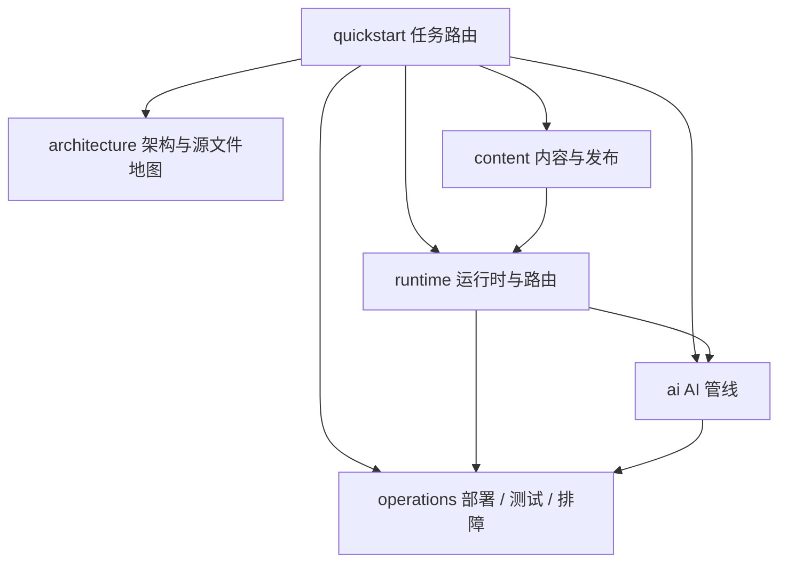

# Rowan Liu Blog Engineering Wiki

`llccing/llccing.github.io` 是一个基于 AstroPaper 深度定制的**静态博客站点**（生产由 Cloudflare Pages 托管），叠加一个 **Cloudflare Worker**（批注/评论 API，含 D1、Queue、Workers AI）与**两条 AI 管线**（每日 digest 生成、文章批注 AI 回答）。本 Wiki 以中文维护，聚焦“哪里改、改什么、怎么验证”，不索引正文内容。

## 最快路径

| 你的问题 | 直接读 |
| --- | --- |
| 站点怎么组成、构建配置在哪 | [架构总览](architecture/overview.md) |
| 某个行为归哪个文件、谁调用它 | [源文件地图](architecture/source-map.md) |
| 内容 schema、draft/发布时间 margin、翻译、tag、RSS/search 边界 | [内容与发布](content/publishing.md) |
| 每个页面路由、Worker API、OAuth、D1、Queue、AI 绑定 | [运行时与路由](runtime/routes.md) |
| digest 生成、批注 AI 回答、两条管线怎么不同 | [AI 管线](ai/pipelines.md) |
| Pages/Worker/D1 部署、环境变量、回滚 | [部署与运维](operations/deployment.md) |
| `pnpm` 命令各自校验什么、有哪些测试 | [测试与校验](operations/testing.md) |
| 故障症状 → 归属 → 首查文件 → 安全命令 | [排障手册](operations/runbook.md) |

## 核心事实（改代码前必知）

- **时区**：`astro.config.ts` 顶部 `process.env.TZ = "Asia/Shanghai"`；digest 的“今天”也按上海时间计算（`scripts/digest/generate.mjs` 的 `beijingToday`）。任何日期逻辑改动都要用上海时间验证。
- **发布 margin**：列表类页面经 `src/utils/postFilter.ts` 过滤 `draft` 且 `now > pubDatetime - 15min`（`SITE.scheduledPostMargin`）；详情页 `getStaticPaths` 只过滤 `draft`，所以未来 15 分钟内的文章 URL 已生成但未被列表链接。
- **四种内容集合**（`src/content/config.ts`）：`blog`、`short-stories`、`originals`（翻译原文）、`digest`（机器生成，独立集合，不进 RSS/tag/搜索）。
- **单一事实源**：`src/config.ts` 的 `SITE`/`LOCALE`/`DIGEST_DOMAINS`；digest 域词汇在 `scripts/digest/sources.mjs` 有 Node 侧镜像副本，**两处必须同步**（见 [内容与发布](content/publishing.md)）。
- **digest 自动化**：`.github/workflows/daily-blog-generator.yml` 每天 02:00 UTC（= 上海 10:00）运行 `scripts/digest/generate.mjs` 并直接提交回 `main`（author=Rowan / committer=bot，**不加 `[skip ci]`**）；无新条目不提交也不报错，有改动必须过 `pnpm check:content`；`workflow_dispatch` 的 `force` 输入可重跑覆盖今日（见 [AI 管线](ai/pipelines.md)）。
- **Cloudflare-first**：生产是 Cloudflare Pages + Worker `rowan-blog-comments` + D1 `rowan-blog-annotations`；`gh-pages` 分支与 `deploy.yml` 是保留的回滚路径（见 [部署与运维](operations/deployment.md)）。
- **island 约定**：默认用 Astro 组件，仅交互必需处用 React 岛（`AGENTS.md`）。

## 任务路由表

| 变更区域 / 意图 | Wiki 页 | 精确源码入口 | 重要符号 / 类型 | 聚焦测试 | 最小验证命令 |
| --- | --- | --- | --- | --- | --- |
| 改站点元数据 / 分页 / digest 域 | [架构总览](architecture/overview.md)、[内容与发布](content/publishing.md) | `src/config.ts` | `SITE`、`LOCALE`、`DIGEST_DOMAINS`、`DIGEST_DOMAIN_LABELS` | （无直接单测） | `pnpm build` |
| 改内容 schema / 新增 collection 字段 | [内容与发布](content/publishing.md) | `src/content/config.ts`、`scripts/check-content.mjs` | zod schema、`checkPost` | （无直接单测） | `pnpm check:content && pnpm build` |
| 加/改文章、短篇、原文、digest frontmatter | [内容与发布](content/publishing.md) | `src/content/config.ts`、`scripts/check-content.mjs` | `postFilter`、`isTranslation`、`sources` | （无直接单测） | `pnpm check:content` |
| 改列表/详情可见性（draft、margin） | [内容与发布](content/publishing.md) | `src/utils/postFilter.ts`、`src/pages/posts/[slug]/index.astro` | `postFilter`、`getSortedPosts` | （无直接单测） | `pnpm build`（含 astro check） |
| 改 tag 聚合 / slugify | [内容与发布](content/publishing.md)、[源文件地图](architecture/source-map.md) | `src/utils/getUniqueTags.ts`、`getPostsByTag.ts`、`slugify.ts`、`src/pages/tags/**` | `github-slugger` | （无直接单测） | `pnpm build` |
| 改 digest 路由 / 聚合工具 | [运行时与路由](runtime/routes.md)、[内容与发布](content/publishing.md) | `src/pages/digest/**`、`src/utils/getDigests.ts` | `getSortedDigests`、`digestDate`、`collectSources` | （无直接单测） | `pnpm build` |
| 改批注协议（marker/限额/路径规约） | [运行时与路由](runtime/routes.md) | `src/comments/protocol.ts` | `ANNOTATION_MARKER`、`AI_REPLY_MARKER`、`AI_QUEUE_MARKER`、`COMMENT_LIMITS`、`normalizeArticlePath` | `src/comments/protocol.test.ts` | `pnpm test -- src/comments/protocol.test.ts` |
| 改批注前端乐观更新 / 轮询 | [源文件地图](architecture/source-map.md) | `src/comments/optimistic.ts`、`src/comments/polling.ts`、`src/components/InlineComments.tsx` | `startSequentialPolling` | `src/comments/{optimistic,polling}.test.ts` | `pnpm test -- src/comments` |
| 改批注锚点注入 | [架构总览](architecture/overview.md) | `src/utils/rehype-comment-anchors.ts` | `data-comment-block-id` | `src/utils/rehype-comment-anchors.test.ts` | `pnpm test -- src/utils/rehype-comment-anchors.test.ts` |
| 改 Worker API 路由 / 会话 / CORS / 镜像 | [运行时与路由](runtime/routes.md) | `workers/comments-api/src/index.ts` | `routeRequest`、`requireOwnerSession`、`scheduleGitHubMirror`、`handle*` | `workers/comments-api/test/index.test.ts` | `pnpm check:worker && pnpm test -- workers/comments-api/test/index.test.ts` |
| 改 D1 读写 / AI job 状态机 | [运行时与路由](runtime/routes.md) | `workers/comments-api/src/d1.ts`、`migrations/comments-api/*.sql` | `createD1Annotation`、`claimD1AiJob`、`completeD1AiJob`、`github_mirror_state` | `workers/comments-api/test/d1.test.ts` | `pnpm test -- workers/comments-api/test/d1.test.ts` |
| 改 digest 管线（源/去重/摘要/写入） | [AI 管线](ai/pipelines.md) | `scripts/digest/{sources,fetch,state,summarize,generate}.mjs` | `SOURCES`、`MAX_PER_DOMAIN`、`filterNew`、`applyCaps`、`extractResponseText` | `scripts/digest/summarize.test.mjs` | `pnpm digest:dry`（离线验证抓取/去重） |
| 改 digest 定时任务 / 提交回 main 行为 | [AI 管线](ai/pipelines.md)、[部署与运维](operations/deployment.md) | `.github/workflows/daily-blog-generator.yml`、`scripts/digest/generate.mjs` | `force` 输入、`check:content` 门禁、author/committer 拆分、`--force`/`--dry-run` 旗标 | — | `workflow_dispatch`（`force=true` 重跑今日）或 `pnpm digest:dry && pnpm check:content` |
| 改批注导出/导入/对账脚本 | [运行时与路由](runtime/routes.md) | `scripts/comments/{export-annotations,d1-backup,d1-cli,import-annotations-to-d1,reconcile-annotations-d1}.{mjs,ts}` | `generateImportSql`、`compareRecordSets` | `scripts/comments/d1-backup.test.ts` | `pnpm test -- scripts/comments/d1-backup.test.ts` |
| 改 GitHub Action 批注 AI 回答 | [AI 管线](ai/pipelines.md) | `scripts/comments/respond-to-ai.ts`、`.github/workflows/annotation-ai.yml` | `AI_REPLY_MARKER`、`hasExistingReply` | （无单测；靠 workflow 端到端） | `pnpm exec tsx scripts/comments/respond-to-ai.ts`（需 GITHUB_EVENT_PATH 环境，仅 CI 语境） |
| 改部署工作流 / wrangler 绑定 | [部署与运维](operations/deployment.md) | `.github/workflows/deploy.yml`、`wrangler.jsonc` | `ANNOTATIONS_DB`、`AI_JOBS`、`routes` | — | `pnpm check:worker && pnpm build` |

> 约定：`pnpm test -- <路径>` 用 vitest 过滤；`pnpm build` 是“最接近完整校验”的命令（`astro check` + `astro build` + jampack）；`pnpm check:worker` 只做 Worker 类型检查与 dry-run，**不是**生产部署验证。详见 [测试与校验](operations/testing.md)。

## 运行拓扑

## Backlog（暂未文档化或证据不足）

- **OpenWiki 自动化状态**：当前仅为本地/手动试点，`.github/workflows/` 没有 OpenWiki workflow；是否在试点稳定后接入每周 PR 更新，留待后续评估。
- **Cloudflare Pages 构建配置细节**：Pages 项目的 build command / 环境变量面板不在仓库内，仅能由 `docs/cloudflare-first-migration-*.md` 与 `deploy.yml` 推断；页面级配置项（如 `PUBLIC_INLINE_COMMENTS`）以仓库工作流为准，面板现状标 `Needs confirmation`。
- **Worker 生产部署与 D1 migration 的自动化**：仓库内没有部署 Worker 或执行生产 migration 的 workflow；当前为人工 `wrangler` 操作（证据：`.github/workflows/` 无对应文件，`docs/cloudflare-first-migration-handoff.md` 记录了生产版本号）。
- **`annotation-ai.yml` 路径状态**：与 Worker Queue 双路径并存的原因与退役计划在仓库内无明确声明，标 `Needs confirmation`（见 [AI 管线](ai/pipelines.md)）。
