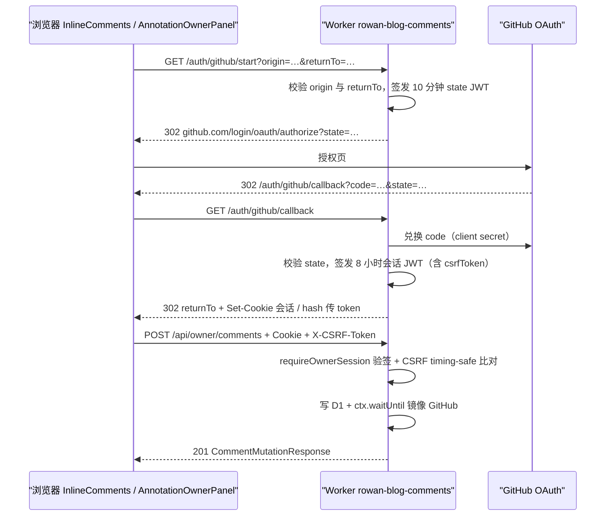
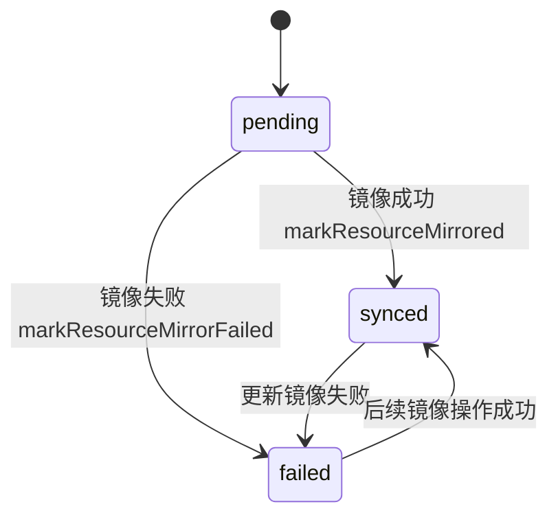

# 运行时与路由

本页分两个可导航分区：[Astro 静态路由族](#astro-静态路由族)（构建期生成）与 [Worker API](#worker-api)（运行时服务）。静态站组装见 [站点架构总览](../architecture/overview.md)，文件归属索引见 [源文件地图](../architecture/source-map.md)。

## Astro 静态路由族

全部页面在构建期静态生成（SSG），数据来源为四种内容集合（见 [内容与发布](../content/publishing.md)）与 `src/data/**` 静态数据。以下按路由族列出输入、过滤、分页与输出。

| 路由族 | 文件 | 输入 / 过滤 | 分页 | 生成输出 | client island |
| --- | --- | --- | --- | --- | --- |
| 首页 | `src/pages/index.astro` | `getSortedPosts`（`postFilter` 后按 `modDatetime ?? pubDatetime` 倒序） | — | featured + 最近 4 篇 | — |
| 文章归档 | `src/pages/posts/index.astro` | `getSortedPosts` | — | 归档列表（`allPosts` 模式隐藏分页） | `Posts.astro` 内联过滤脚本（`data-post-filter-root`） |
| 文章详情 + 分页数字 | `src/pages/posts/[slug]/index.astro` | `getStaticPaths`：blog 集合 `!draft`；`getPageNumbers(posts.length)` 生成页码 slug | `/posts/2/` 等 | 详情（`PostDetails.astro`）或分页页（`Posts.astro`） | `InlineComments`（`client:only`，仅 `PUBLIC_INLINE_COMMENTS === "true"`）、Giscus `Comments`（`client:only`） |
| 文章 OG 图 | `src/pages/posts/[slug]/index.png.ts` | 无 `ogImage` 的文章按 `slugifyStr(title)` 生成 | — | 1200×630 PNG | — |
| 短篇归档/详情 | `src/pages/short-stories/index.astro`、`short-stories/[slug]/index.astro` | 同 posts 模式，`collection="short-stories"` | 同 | 同 | 同 |
| tag | `src/pages/tags/index.astro`、`tags/[tag]/index.astro`、`tags/[tag]/[page].astro` | 合并 blog + short-stories；slug 经 `github-slugger`（`src/utils/getUniqueTags.ts`/`getPostsByTag.ts`/`slugify.ts`） | 有 | tag 列表/分页 | — |
| digest 总览 | `src/pages/digest/index.astro` | `getSortedDigests` + `withinDays(7)`/`currentMonth`/`groupByMonth`/`collectSources`/`sourcesByDomain`/`domainCounts`（`src/utils/getDigests.ts`） | — | 最新/本周/本月/归档 + 按域计数条 | — |
| digest 详情 | `src/pages/digest/[...slug].astro` | `getStaticPaths` 用 slug `YYYY/MM/DD` | — | 单日 digest + `DigestSourceList` | — |
| digest 域时间线 | `src/pages/digest/domain/[domain].astro` | `entriesForDomain`（按 `DIGEST_DOMAINS` 枚举） | — | 该域历史条目 | — |
| projects | `src/pages/projects/index.astro`、`projects/[slug].astro` | `src/data/projects.ts`（`Project` 类型） | — | 项目列表 / case study | — |
| radio | `src/pages/radio/index.astro` | `src/data/radio-data.ts` | — | 电台列表 | `RadioPlayer`（`client:load`） |
| 搜索 | `src/pages/search.astro` | blog 非 draft 列表 | — | `?q=` 过滤 | `SearchBar`（`client:load`，Fuse.js） |
| 作者工作区 | `src/pages/annotations.astro` | — | — | 批注管理模式 | `AnnotationOwnerPanel`（`client:load`，相对 `/api/owner/*`） |
| 静态页 | `src/pages/about.md`（`AboutLayout`）、`portfolio.astro`、`shanghai/index.astro` | `portfolio.resume.json` + `PortfolioExperience`（`client:load`）；`src/data/company-data.ts` + 内联脚本 | — | 页面 | `PortfolioExperience` |
| 端点 | `src/pages/rss.xml.ts`、`robots.txt.ts`、`og.png.ts`、`404.astro` | RSS 仅 blog；robots 引用 sitemap；`/og.png` 站点级 OG 图 | — | XML / txt / PNG / 404 | — |

注意 `posts/[slug]` 同时承担“文章 slug”与“页码”两种参数（`getStaticPaths` 合并两种结果），因此 `/posts/2/` 是第 2 页而非 slug 为 `2` 的文章。

## Worker API

Worker 名 `rowan-blog-comments`（`wrangler.jsonc`），入口 `workers/comments-api/src/index.ts`，D1 读写全部在 `workers/comments-api/src/d1.ts`。路由挂载在 `rowanliu.com/api/*` 与 `rowanliu.com/auth/*`。

### 路由表

| 方法与路径 | 处理器 | 输入 | 输出 / 状态码 | 错误码（`error.code`） |
| --- | --- | --- | --- | --- |
| `OPTIONS` 任意 | `routeRequest` | Origin | 204 + CORS 头 | — |
| `GET /health` | `routeRequest` | — | `{ok:true, service:"rowan-blog-comments"}` | — |
| `GET /auth/github/start` | `handleOAuthStart` | `origin`（须在 `ALLOWED_ORIGINS`）、`returnTo`（同 origin 且路径受 `isAllowedReturnPath` 约束） | 302 → GitHub authorize；JWT state（10 分钟，audience `rowan-comments-oauth-state`） | `invalid_origin`、`invalid_return_url`、`setup_required` |
| `GET /auth/github/callback` | `handleOAuthCallback` | code + state | 校验后签发会话 JWT（8 小时，HS256，audience `rowan-comments-owner`）；同源写 `__Host-rowan-comments-owner` cookie，跨源（preview）经 URL hash `rowan-comments-auth=` 回传 token | `oauth_invalid`（缺 code/state 或 state 校验失败）、`oauth_failed`（GitHub 兑换失败）、`forbidden`（非 `OWNER_LOGIN` 账号） |
| `GET /api/comments?path=` | `handleGetComments` | `path`（经 `normalizeArticlePath` 规约） | 200 `CommentListResponse`（`version`/`discussion`/`threads`/`truncated`）+ `ETag: "comments-{version}"`；`If-None-Match` 命中返回 304 | `invalid_path` |
| `GET /api/owner/session` | `routeRequest` | Bearer 或 cookie 会话 | 200 `{canWrite,login,csrfToken}`（`no-store`）；未登录返回 200 `{canWrite:false}`（非 401） | — |
| `POST /api/owner/logout` | `routeRequest` | 会话 + CSRF | 204 + 清 cookie | `unauthorized`、`csrf_invalid` |
| `POST /api/owner/comments` | `handleCreateComment` | `CreateCommentInput`（`path`/`articleTitle`/`body`/`anchor?`/`replyToId?`）；回复目标不存在返回 404 | 201 `CommentMutationResponse`（含乐观更新所需 `version`/`thread`/`reply`）；正文含 `@ai` 时创建 `ai_jobs` 并投递 Queue | `invalid_comment`、`anchor_required`、`comment_not_found`、`origin_not_allowed`、`body_too_large` |
| `PATCH /api/owner/comments/:id` | `handleUpdateComment` | 会话 + CSRF + 新 body | 200 更新后资源；编辑记录进 `annotation_revisions`；镜像更新 | `unauthorized`、`csrf_invalid`、`comment_not_found` |
| `DELETE /api/owner/comments/:id` | `handleDeleteComment` | 会话 + CSRF | 200；软删除（`deleted_at`），版本号递增；已镜像资源同步删 GitHub 评论 | `unauthorized`、`csrf_invalid`、`comment_not_found` |
| `POST /api/owner/annotations/:id/ai/retry` | `handleRetryAiJob` | 会话 + CSRF | 200；`completed` 的 job 幂等返回现状，否则重置状态为 queued 并重新投递 Queue | `unauthorized`、`ai_job_not_found`、`ai_enqueue_failed`（503） |
| 其余 | `routeRequest` | — | 404 | `not_found` |

公共读接口（`GET /api/comments`）不需要会话；全部 owner 写接口要求会话，cookie 会话时还要求 `X-CSRF-Token` 头。请求体上限 `MAX_REQUEST_BYTES = 24_000`（超限 413 `body_too_large`）。

### 会话与认证流（OAuth → JWT → CSRF）

`SESSION_SECRET` 派生 HS256 密钥（`sessionKey`）；会话载荷含 `login` + `csrfToken`，须 `sub === login === env.OWNER_LOGIN`。cookie 为 `__Host-rowan-comments-owner`（HttpOnly、Secure、SameSite=Lax、8 小时）；preview 等跨源场景回退为 URL hash 传 token（`AnnotationOwnerPanel`/`InlineComments` 从 hash 读取后清理）。



### D1 数据模型（`migrations/comments-api/`）

- `0001_annotations_shadow.sql`：`articles`、`annotations`、`replies`、`annotation_revisions`、`ai_jobs` 五表 + 外键 + 索引。
- `0002_d1_primary.sql`：三表加 `github_mirror_state`（`pending|synced|failed`）与索引，D1 转为主存储。
- `0003_queue_ai.sql`：`ai_jobs.reply_id/updated_at`、`replies.ai_job_id` 唯一部分索引、`ai_jobs(status, updated_at)` 索引（Queue AI 落地）。

```mermaid
erDiagram
  articles ||--o{ annotations : "one discussion per path"
  articles {
    text path PK
    text github_discussion_id UK
    int version
    text github_mirror_state
  }
  annotations ||--o{ replies : "thread replies"
  annotations {
    text id PK
    text article_path FK
    text github_node_id UK
    text block_id
    text github_mirror_state
    text status "open|deleted"
  }
  replies {
    text id PK
    text annotation_id FK
    text kind "human|ai"
    text ai_job_id FK
    text github_mirror_state
  }
  annotation_revisions {
    int id PK
    text resource_type
    text resource_id
    text previous_body
  }
  ai_jobs {
    text id PK
    text annotation_id FK UK
    text status "queued|answering|completed|failed"
    int attempt_count
    text provider
    text model
    text reply_id
  }
```

不变量：

- **版本号**：每次写操作递增 `articles.version`，`GET /api/comments` 用 `ETag: "comments-{version}"` 返回，配合前端乐观更新避免整列表重载。
- **软删除**：`annotations.status`/`deleted_at` 与 `replies.deleted_at`；列表查询排除 `deleted_at IS NOT NULL`，删除只标记不物理清除（GitHub 侧同步删除镜像评论）。
- **AI job 与 reply 一对一**：`replies.ai_job_id` 唯一部分索引保证一个 job 至多产生一条 AI 回复（`completeD1AiJob` 幂等写）。
- **镜像状态机**：D1 写成功即成功（HTTP 不等待镜像）；镜像失败记 `github_mirror_failed` 日志并把资源标为 `failed`。



注意：`createD1Annotation` 初始写入 `github_mirror_state = 'pending'` 且 `github_node_id` 为 `pending:{id}` 占位符。**已镜像资源**（真实 node id）更新镜像失败后，下次编辑会重跑镜像恢复为 `synced`；**创建即失败**的资源只有占位 id，仓库内没有自动重试调度器（无 mirror retry API），恢复依赖人工处理或迁移工具（`Needs confirmation`）。

### Queue 与 Workers AI

- `wrangler.jsonc`：producer binding `AI_JOBS` → queue `rowan-blog-ai-jobs`；consumer `max_batch_size: 1`、`max_batch_timeout: 1`、`max_retries: 3`、`retry_delay: 15`。
- 消息体 `AiJobMessage`（`jobId`/`annotationId`/`articlePath`）；`processAiMessage` 解析失败即 ack 并记录 `comments_ai_invalid_message`。
- 处理：`claimD1AiJob`（原子抢占，返回 `null`/`"completed"` 时直接 ack）→ `answerAiJob`（`loadArticleContext` 用 `HTMLRewriter` 抓 `article h1..p,li`，正文上限 12 000、关联文章 6 000；`env.AI.run("@cf/zai-org/glm-4.7-flash", ...)`，700 tokens、temperature 0.2）→ `completeD1AiJob` 写 AI 回复 → 镜像。
- 失败重试：指数退避 `min(15 * 2^attempts, 120)` 秒，第 3 次后 ack 放弃；错误码 `empty_response` / `inference_failed`；投递失败（`enqueueAiJob`）标 `enqueue_failed`。前端在 AI job `queued|answering` 时以 1.5s 间隔顺序轮询（`src/comments/polling.ts` 的 `startSequentialPolling`），详见 [AI 管线](../ai/pipelines.md)。

### Discussion → D1 数据迁移/对账生命周期

`scripts/comments/` 工具链（均要求 `--local` 或 `--remote` 二选一，经 `d1-cli.ts` 的 `targetFlag` 强制）：

1. `export-annotations.mjs`（`pnpm comments:export`）：GitHub GraphQL 扫描 category 内 discussions，解析 `rowan-annotation:v1` marker，导出 JSON 备份。
2. `import-annotations-to-d1.ts`（`pnpm comments:d1:import --input … [--local|--remote]`）：`d1-backup.ts` 的 `generateImportSql` 生成幂等 upsert SQL（`ON CONFLICT … DO UPDATE`，**不清除软删除**），临时 SQL 文件 0600 权限、执行后删除。
3. `reconcile-annotations-d1.ts`（`pnpm comments:d1:reconcile`）：对比备份与 D1 实际行（`compareRecordSets`：`missing`/`field_mismatch`/`unexpected`），`mismatchCount > 0` 时以非零码退出并写 JSON 报告到 `artifacts/cloudflare-migration/`（gitignore）。

聚焦测试：`scripts/comments/d1-backup.test.ts`（SQL 转义、幂等 upsert 不清软删、`compareRecordSets` 分类、wrangler JSON 解析）。

### 验证

- Worker 单测：`pnpm test -- workers/comments-api/test/index.test.ts`（路由/会话/CSRF/镜像失败路径）与 `d1.test.ts`（D1 行为）。
- Worker 类型与配置：`pnpm check:worker`（`tsc --noEmit` + `wrangler deploy --dry-run`，**不部署**）。
- 生产健康检查：`GET https://rowanliu.com/health` 或 `https://rowan-blog-comments.lcf33123.workers.dev/health`。
