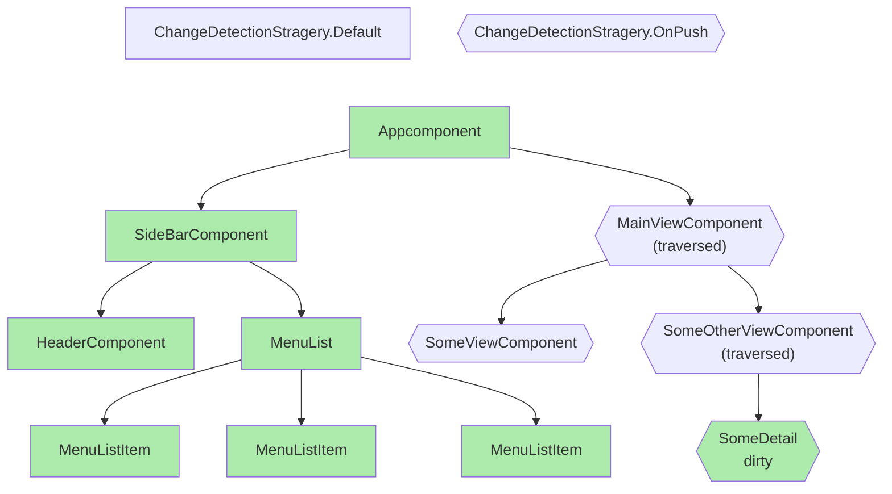

> 原文地址: https://riegler.fr/blog/2025-02-16-incremental-dom/

像 Angular 这样的 Web 框架，最初就是为了解决“直接操作 DOM”带来的复杂度而诞生的。它们为开发者提供了更声明式、更高效的方式来构建动态 UI。使用原生 JavaScript API 直接操作 DOM 通常笨重、容易出错，而且性能开销高，因为 DOM 操作本身就很昂贵。为此，框架引入了抽象层，例如 Angular 的声明式模板，或 React 的 Virtual DOM，以优化变更应用到 DOM 的过程。通过批量更新、减少直接 DOM 访问、利用差异计算算法，框架显著提升了渲染性能与开发效率。归根结底，它们在命令式 DOM API 与现代声明式组件开发之间搭建了桥梁。

简单说，框架的职责之一，就是尽可能减少 DOM 操作。本文将深入 Angular 为优化 DOM 操作所采用的不同策略。

## Angular 的渲染方式：声明式模板

早在 2019 年，Angular 团队发布了新的渲染引擎 Ivy。顺带一提，Ivy 的故事在 [Honeypot 的 Angular 纪录片](https://www.youtube.com/watch?v=cRC9DlH45lA) 中也有提及。

Ivy 的核心思想是：每个组件模板都会被编译成一组 JavaScript 指令，这些指令组成一个模板函数。

<div style="display:flex; flex-direction: row; gap: 16px; flex-wrap: wrap">

<div style="flex:1; min-width: 200px;">

#### `一个基础组件模板`

```html
<div>this is a div, with a value: {{ myValue }}</div>
```

</div>

<div style="flex:1; min-width: 200px;">

#### `对应的指令表示`

```js
function MyComponentTemplateFn(rf, ctx) {
  if (rf & 1) {
    /* creation mode */
    ɵɵelementStart(0, "div");
    ɵɵtext(1);
    ɵɵelementEnd();
  }
  if (rf & 2) {
    /* update mode */
    ɵɵadvance();
    ɵɵtextInterpolate1("this is a div, with a value: ", ctx.myValue, "");
  }
}
```

</div>
</div>

你可以通过[我做的这个 demo](https://jeanmeche.github.io/angular-compiler-output/)自己试试，它可以展示你写出的任意 Angular 模板的编译指令。

可以看到，这个模板函数被分成两个阶段：

- 创建阶段（creation mode）
- 更新阶段（update mode）

### 创建阶段

模板函数的创建阶段，是框架初始化并创建组件 DOM 结构的阶段。
在这个阶段里，Ivy 会执行一系列模板指令：创建 DOM 元素、绑定属性、建立初始数据绑定。

创建阶段本质上是渲染过程的第一步：把组件模板变成“活的”DOM 结构。

在前面的示例中，创建阶段会创建两个节点：一个 DIV 节点，里面有一个（此时为空的）文本节点。

### 更新阶段

创建阶段完成后，Angular 进入更新阶段。这个阶段处理组件状态变化，并按需更新 DOM。将创建与更新分离，让 Ivy 可以只在必要时修改内容，而不是整棵 DOM 重建。

在前面的示例中，更新阶段会把文本插值的内容写入文本节点。

### 可视化创建/更新差异：DOM 变化提示

我们可以直观看到创建阶段与更新阶段的差异。
例如，Chrome DevTools 在 Rendering 选项卡里有一个功能：让被更新的 DOM 元素闪烁。


---

开启后，我们来写一个简单例子：一个静态 DIV 和一个动态 DIV。

<div style="display:flex; flex-direction: row; gap: 16px">

<div style="flex:1; min-width: 200px;">

#### `组件与模板`

```typescript
@Component({
  template: `
    <div>This is static</div>
    <div>This is updated {{ sig() }}</div>
  `,
})
export class AppComponent {
  sig = signal(0);

  constructor() {
    setInterval(() => {
      this.sig.update(v => v + 1);
    }, 1000);
  }
}
```

</div>

<div style="flex:1; min-width: 200px;">

#### `编译后的模板函数`

```js
function MyComponentTemplateFn(rf, ctx) {
  if (rf & 1) {
    ɵɵelementStart(0, "div");
    ɵɵtext(1, "This is static");
    ɵɵelementEnd();
    ɵɵelementStart(2, "div");
    ɵɵtext(3);
    ɵɵelementEnd();
  }
  if (rf & 2) {
    ɵɵadvance(3);
    ɵɵtextInterpolate1("This is updated ", ctx.sig(), "");
  }
}
```

</div>
</div>

这个模板会创建两个 DIV：

1. 第一个只有静态节点，只在创建阶段生成。
2. 第二个包含插值，插值在更新阶段计算。

signal 每秒更新一次，框架会调度一次同步，重新执行模板函数。


我们可以看到，在更新时两个 DIV 本身都没有变化。真正被更新的只有动态 DIV 中的文本节点。

[Stackblitz Demo](https://stackblitz.com/edit/angular-incremental-dom-blink)

### 列表渲染与节点复用

Angular 的 `@for`（v17 随 @-block 控制流一起引入）在列表渲染时，会尽量复用已有 DOM 节点。

而 `track` 函数让这件事更高效。你可以为每个列表项指定唯一标识，Angular 就能更智能地判断哪些节点可以复用，而不是全部重建。这样可以减少无意义的 DOM 操作，提升渲染性能，并让频繁增删改排序的动态列表更新更平滑。`track` 是一个小功能，但非常有价值，也体现了 Angular 在性能和开发体验上的取向。

## 模板渲染的执行时机

你现在已经知道：Angular 是通过执行组件模板函数来更新 DOM 的。
但问题是：模板函数在什么时候执行？哪些组件会执行？

Angular 的同步机制（过去称为 Change Detection，CD）会遍历组件树，并执行那些需要同步的组件模板函数。

根据 ChangeDetection 策略不同，组件要么总会被检查（`Default`），要么只有在被标记为 dirty 时才检查（`OnPush`）。



在现代应用里，“组件是否 dirty”大多由 signal 与响应式依赖树驱动。signal 更新后，会把使用它的组件标记为 dirty。

这里你能看到第二层性能优化：
使用 `OnPush` 时，框架只同步它明确知道 dirty 的组件，其余组件会被跳过，从而节省 CPU 时间。

## 记忆化与脏值检查

我们已经看到两点：

- Angular 只更新动态内容。
- Angular 只在 dirty 组件上运行更新。

现在再看最后一层优化：记忆化（memoization）与脏值检查（dirty checking）。

回到一个包含动态表达式（如插值）的模板函数：

```typescript
function MyComponentTemplateFn(rf, ctx) {
  if (rf & 1) {
    ...
  }
  if (rf & 2) {
    ɵɵadvance(3);
    ɵɵtextInterpolate1('This is updated ', ctx.sig(), '');
  }
}
```

即便插值是动态的，它仍只是这个模板函数中的一部分。
模板函数可能会执行，但这条插值不一定真的发生变化（也许变化的是其他插值）。

在这种情况下，Angular 会记忆化插值结果。
当执行到该指令时，它会把本次结果与上次结果比较，只有当值（字符串）变化时，才真正更新 DOM。

这进一步避免了昂贵且不必要的 DOM 操作。

## 总结

Angular 的声明式模板与基于视图的响应式渲染，在性能和效率上都非常有竞争力。它通过“增量更新 + 直接 DOM 操作”来优化渲染路径，给开发者提供了更高效、更直观的动态 UI 构建方式。尽管 React 让 Virtual DOM 更广为人知，但 Angular 的声明式策略也证明了：实现高性能 Web 应用并不只有一条路。

随着 Web 开发持续演进，Angular 在模板与渲染机制上的持续创新，也让它在生态中保持强劲竞争力。无论你在做小项目还是大型企业应用，理解这些渲染策略都能帮助你做出更合适的技术决策。

## 备注

Alex Rickabaugh 在 [NgGlühwein 2024 演讲](https://www.youtube.com/watch?v=uTqu_eR80ss&t=1s)中分享了一个关键思路转变：团队重新定义了对 ChangeDetection 的理解，把它视为“模型与 DOM 的同步过程”。

本文最初版本把 Angular 的渲染策略描述为 "Incremental DOM"。后来我了解到 Incremental DOM 实际是另一种策略。它与 VDOM 有些相似，但不会创建中间树，而是直接与真实 DOM 做差异对比。可参考 Google 的 [incremental-dom library](https://google.github.io/incremental-dom/)。
